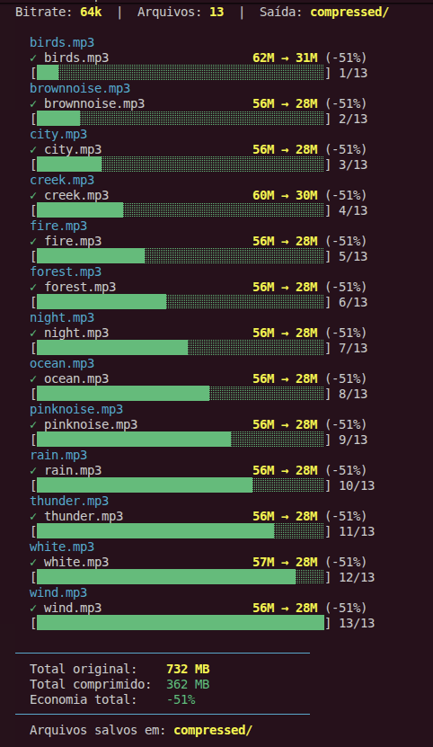

# Compressor de mp3 ꕤ
Comprime arquivos `.mp3` em lote usando `ffmpeg`, reduzindo o tamanho sem perda de qualidade perceptível.

**Requisito:** `ffmpeg`.

## O que faz:

* Comprime todos os `.mp3` da pasta para 64kbps.
* Salva os arquivos em `compressed/` sem sobrescrever os originais.
* Mostra resumo total de espaço economizado ao final.

```bash
bash compress.sh
```

## Demo
